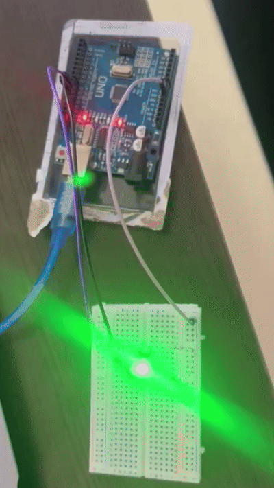

İLKİ FLİP FLOP UMSU 

void setup() {
  pinMode(8, OUTPUT);
  pinMode(9, OUTPUT);
  pinMode(10, OUTPUT);
}

void loop() {
  digitalWrite(8, HIGH);                      
  digitalWrite(9, LOW);
  digitalWrite(10, LOW);   
  delay(500);                           
  digitalWrite(9, HIGH);
  digitalWrite(8, LOW);
  digitalWrite(10, LOW);   
  delay(500); 
  digitalWrite(10, HIGH);                      
  digitalWrite(8, LOW);
  digitalWrite(9, LOW);   
  delay(500);                  
}

